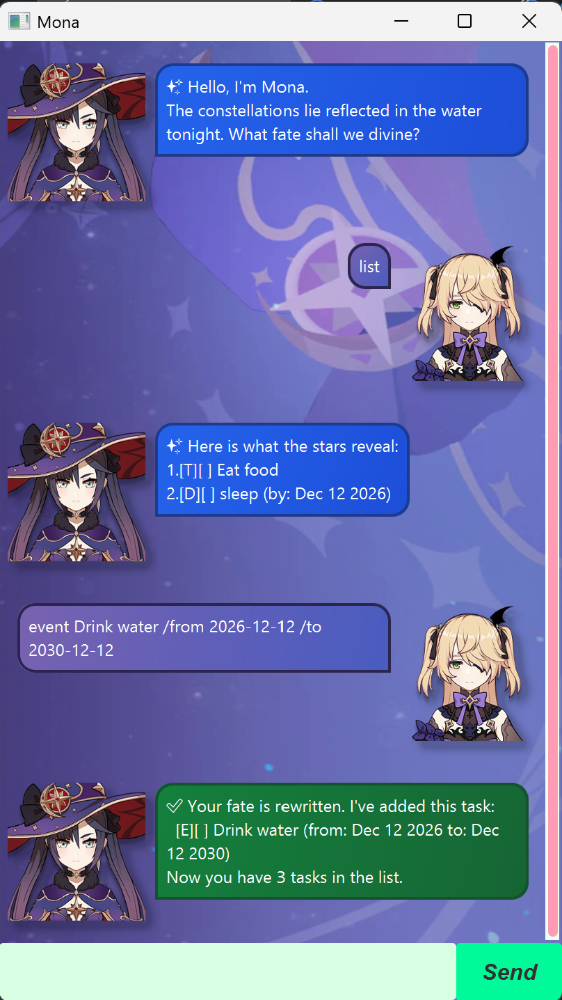

# Mona

Mona is a desktop chatbot that helps you track todos, deadlines, and events by typing
short commands. It's named after the Genshin Impact character _Mona_.



## User Guide

### Quick start

1. Ensure you have Java 25 installed.
2. Download `duke.jar` (see [Packaging as a JAR file](#packaging-as-a-jar-file) below,
   or grab it from your instructor if provided) and copy it into an empty folder.
3. Open a command window in that folder and run:
   ```
   java -jar duke.jar
   ```
4. Type a command in the input box and press Enter (or click Send) to talk to Mona.
   Your tasks are saved automatically to a `data` folder next to the jar, so they're
   still there the next time you start Mona.

### Features

> **Notes on command format**
> * Words in `UPPER_CASE` are parameters you supply, e.g. in `todo DESCRIPTION`,
>   `DESCRIPTION` can be `todo read book`.
> * Dates are entered as `yyyy-mm-dd`, optionally followed by a 24-hour time, e.g.
>   `2019-10-15` or `2019-10-15 1800`.
> * Extra whitespace around parameters is ignored.
> * Mona's replies are colour-coded: blue for general information, green for a
>   successful change, and red for an error.
> * Commands are case-sensitive, e.g. `todo` works but `Todo` does not.

#### Adding a todo: `todo`

Adds a todo task, which has a description but no date/time attached.

Format: `todo DESCRIPTION`

Example: `todo read book`

#### Adding a deadline: `deadline`

Adds a task that needs to be done by a specific date/time.

Format: `deadline DESCRIPTION /by DATE`

Example: `deadline return book /by 2019-10-15`

#### Adding an event: `event`

Adds a task that spans a start and end date/time.

Format: `event DESCRIPTION /from START_DATE /to END_DATE`

Example: `event project meeting /from 2019-10-15 /to 2019-10-16`

#### Listing all tasks: `list`

Shows all tasks currently tracked by Mona, numbered in the order they were added.

Format: `list`

#### Finding tasks: `find`

Finds tasks whose description contains the given keyword (case-insensitive).

Format: `find KEYWORD`

Example: `find book`

#### Viewing tasks on a date: `on`

Shows tasks that fall on the given date, including deadlines due that day and events
spanning that day.

Format: `on DATE`

Example: `on 2019-10-15`

#### Viewing upcoming tasks: `in`

Shows tasks that fall a given number of days from today.

Format: `in DAYS`

Example: `in 3` shows tasks occurring 3 days from today.

#### Sorting tasks: `sort`

Sorts tasks chronologically by their date/time (todos, which have no date, are listed
last, in their original order).

Format: `sort`

#### Marking a task as done: `mark`

Marks the task at the given list position as done.

Format: `mark INDEX`

Example: `mark 2` marks the 2nd task shown in `list` as done.

#### Marking a task as not done: `unmark`

Marks the task at the given list position as not done.

Format: `unmark INDEX`

#### Deleting a task: `delete`

Deletes the task at the given list position.

Format: `delete INDEX`

Example: `delete 3` deletes the 3rd task shown in `list`.

#### Exiting the program: `bye`

Says farewell and closes Mona.

Format: `bye`

### Saving your data

Mona automatically saves your tasks to disk after every command that changes them.
There is no need to save manually.

## Setting up in Intellij

Prerequisites: JDK 25, update Intellij to the most recent version.

1. Open Intellij (if you are not in the welcome screen, click `File` > `Close Project` to close the existing project first)
1. Open the project into Intellij as follows:
   1. Click `Open`.
   1. Select the project directory, and click `OK`.
   1. If there are any further prompts, accept the defaults.
1. Configure the project to use **JDK 25** (not other versions) as explained in [here](https://www.jetbrains.com/help/idea/sdk.html#set-up-jdk).<br>
   In the same dialog, set the **Project language level** field to the `SDK default` option.
1. After that, locate the `src/main/java/Mona.java` file, right-click it, and choose `Run Mona.main()` (if the code editor is showing compile errors, try restarting the IDE). If the setup is correct, you should see something like the below as the output:
   ```
    __  __  ___  _   _    _ 
   |  \/  |/ _ \| \ | |  / \
   | |\/| | | | |  \| | / _ \
   | |  | | |_| | |\  |/ ___ \
   |_|  |_|\___/|_| \_/_/   \_\
   ```

**Warning:** Keep the `src\main\java` folder as the root folder for Java files (i.e., don't rename those folders or move Java files to another folder outside of this folder path), as this is the default location some tools (e.g., Gradle) expect to find Java files.

## Packaging as a JAR file

To build a standalone executable JAR (bundling all dependencies), run:

```
./gradlew shadowJar
```

This produces `build/libs/duke.jar`. Copy that file into an empty folder and run it from
a command window opened in that same folder:

```
java -jar "duke.jar"
```
